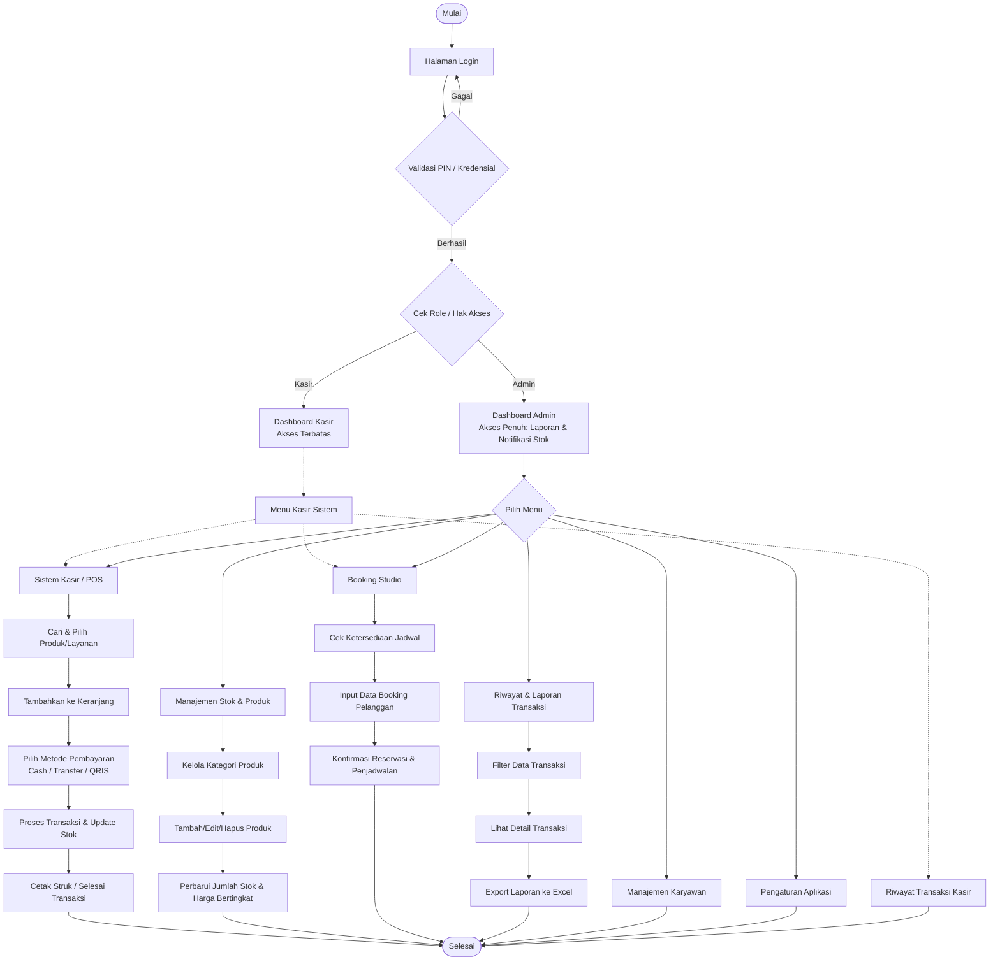

# Studio POS - Stock Management System


[](https://doi.org/10.5281/zenodo.18742580)


Sistem Point of Sale (POS) dan Manajemen Stok untuk studio foto dan percetakan. Aplikasi ini dirancang untuk membantu mengelola transaksi, stok produk, dan laporan keuangan dengan antarmuka yang user-friendly.

## ✨ Fitur Utama

- **💳 Sistem Kasir**: Transaksi cepat dengan berbagai metode pembayaran (Tunai, Transfer, QRIS) (manual confirm)
- **📦 Manajemen Stok**: Tracking stok produk dengan sistem multi-level pricing
- **👥 Multi-User**: Dukungan untuk Admin dan Kasir dengan hak akses berbeda
- **📊 Dashboard**: Laporan real-time untuk revenue, transaksi, dan stok
- **📈 Riwayat Transaksi**: Filter dan export data transaksi ke Excel
- **📅 Booking Studio**: Sistem booking untuk layanan studio
- **🔒 Keamanan**: Login dengan PIN, rate limiting, dan security headers

## 🚀 Instalasi Cepat

### Prasyarat
- PHP 8.1 atau lebih tinggi
- Composer
- MySQL 5.7+ atau MariaDB 10.3+
- Node.js 16+ dan NPM (opsional)

### Langkah Instalasi

1. **Clone Repository**
   ```bash
   git clone https://github.com/epennotgg/Studio-POS
   cd studio-pos
   ```

2. **Install Dependencies**
   ```bash
   composer install
   npm install (opsional)
   npm run build (opsional)
   ```

3. **Setup Environment**
   ```bash
   cp .env.example .env
   php artisan key:generate
   ```

4. **Konfigurasi Database**
   Edit file `.env` dan sesuaikan konfigurasi database:
   ```env
   DB_CONNECTION=mysql
   DB_HOST=127.0.0.1 (ganti dengan web lain jika menggunakan cloud)
   DB_PORT=3306 (ganti dengan port lain jika menggunakan cloud)
   DB_DATABASE=studio_pos
   DB_USERNAME=your_username
   DB_PASSWORD=your_password
   ```

5. **Migrasi Database**
   ```bash
   php artisan migrate
   php artisan db:seed
   ```

6. **Jalankan Server**
   ```bash
   php artisan serve
   ```

7. **Akses Aplikasi**
   - Buka browser dan akses: `http://127.0.0.1:8000`
   - Login default:
     - **Admin**: username: `admin`, PIN: `123456`
     - **Kasir**: username: `kasir`, PIN: `123456`

## 🔐 Keamanan untuk Production

### 1. Environment Configuration
- Selalu set `APP_DEBUG=false` di production
- Generate APP_KEY yang kuat: `php artisan key:generate --force`
- Gunakan HTTPS: set `APP_URL=https://your-domain.com`
- Enable force HTTPS: `FORCE_HTTPS=true`

### 2. Database Security
- Gunakan user database khusus dengan hak akses terbatas
- Selalu backup database secara berkala
- Enable SSL untuk koneksi database jika tersedia

### 3. File Permissions
```bash
# Set proper permissions
chmod -R 755 storage bootstrap/cache
chmod -R 775 storage/logs
chown -R www-data:www-data storage bootstrap/cache
```

### 4. Server Security
- Update `.htaccess` di public folder untuk security headers
- Enable firewall dan rate limiting
- Setup SSL certificate
- Regular security updates

### 5. Application Security
- Ubah PIN default setelah instalasi
- Enable session encryption: `SESSION_ENCRYPT=true`
- Setup proper CORS policies jika diperlukan
- Monitor logs untuk aktivitas mencurigakan

## 🔎 Alur Sistem (Flowchart)

Berikut adalah visualisasi alur kerja utama dari aplikasi Studio POS:



## 📁 Struktur Proyek

```
studio-pos/
├── app/
│   ├── Http/Controllers/     # Controller aplikasi
│   ├── Models/              # Eloquent models
│   └── Providers/           # Service providers
├── config/                  # Konfigurasi aplikasi
├── database/
│   ├── migrations/          # Database migrations
│   └── seeders/            # Database seeders
├── public/                  # Public assets
│   └── .htaccess           # Apache configuration
├── resources/
│   ├── views/              # Blade templates
│   └── js/                 # JavaScript assets
├── routes/                  # Route definitions
├── storage/                 # Storage for logs, cache, etc.
└── tests/                   # Automated tests
```

## 🔧 Konfigurasi Tambahan

### Email Configuration
Untuk mengirim email notifikasi, konfigurasi di `.env`:
```env
MAIL_MAILER=smtp
MAIL_HOST=smtp.gmail.com
MAIL_PORT=587
MAIL_USERNAME=your-email@gmail.com
MAIL_PASSWORD=your-app-password
MAIL_ENCRYPTION=tls
```

### Cache Configuration
Untuk performa yang lebih baik, gunakan Redis:
```env
CACHE_DRIVER=redis
REDIS_HOST=127.0.0.1
REDIS_PASSWORD=null
REDIS_PORT=6379
```

## 🧪 Testing

```bash
# Run PHPUnit tests
php artisan test

# Run specific test
php artisan test --filter=TransactionTest
```

## 📄 License

Aplikasi ini open-source dibawah lisensi [MIT](LICENSE).

## 🤝 Kontribusi

1. Fork repository
2. Buat branch fitur (`git checkout -b feature/amazing-feature`)
3. Commit perubahan (`git commit -m 'Add amazing feature'`)
4. Push ke branch (`git push origin feature/amazing-feature`)
5. Buat Pull Request

## 🐛 Reporting Issues

Jika menemukan bug atau masalah keamanan, silakan buka [issue](https://github.com/epennotgg/Studio-POS/issues) di GitHub.

## 📞 Support

Untuk dukungan teknis atau pertanyaan:
- Email: support@mbeek.my.id
- Discord: [Biji Harimau Corner](https://discord.com/invite/uFACaFguZj)

---

**⚠️ PERINGATAN KEAMANAN:** Please ganti default password setelah instalasi dan jangan pernah expose file `.env` ke public!
